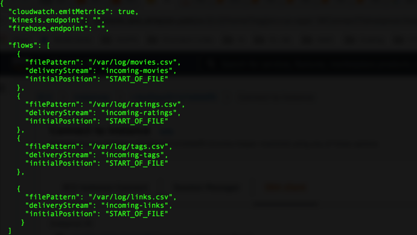
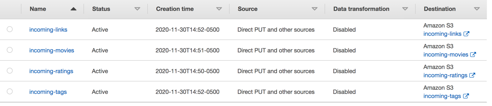
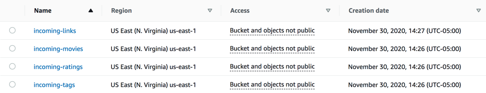

# Data Ingestion & Transformation
## About Dataset
Dataset for this project is acquired from grouplens.org. These datasets will change over time, and are not appropriate for reporting research results. We will keep the download links stable for automated downloads. We will not archive or make available previously released versions.Small: 100,000 ratings and 3,600 tag applications applied to 9,000 movies by 600 users. Last updated 9/2018.

## Data Ingestion Phase
For the sake of this project, we have simulated a scenario where the data is located on a server on EC2 Instance.
An EC2 instance is been provisioned, downloaded the data from grouplens using a wget features

ratings.csv: userId, movieId, rating, timestamp
tags.csv: userId, movieId, tag, timestamp
movies.csv: movieId, title, genres
links.csv: movieId, imdbId, tmdbId

### Kinesis Agent
Installed a kineses agent, and configured the agent to load files from the source. Since this is not a streaming application, we had to use the "START_OF_THE_FILE" to read the whole file

### Kinesis Firehose Streams

Configured four firehose streams, corresponding to each files withi the directors.

#### Destination

We had to create 4 S3 buckets inorder to transport the files from the source location to the destination S3 bucket

