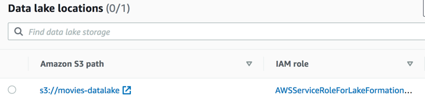
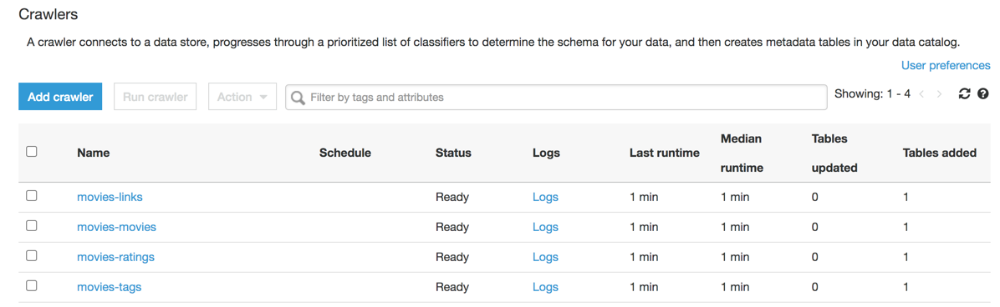

# Data Preparation
In this phase, going to leverage Lakeformation, Lakeformation provides a single interface to manage security controls and ease of use of Glue ETL features.

# Lake Formation
Lakeformation provides a unified interface to manage the user persmissions/access to the data sources, and other assets.
Here we have created a lakeformation database user, and has provided permissions to create data catalog tables and exection of glue jobs and transformation.



### AWS GLUE Crawlers


### AWS Glue Transformation
```
datasource0 = glueContext.create_dynamic_frame.from_catalog(database = "movies", table_name = "ratings19", transformation_ctx = "datasource0")

```

### Apply Mapping

````
applymapping1 = ApplyMapping.apply(frame = datasource0, mappings = [("userid", "long", "userid", "long"), ("movieid", "long", "movieid", "long"), ("rating", "float", "rating", "float"), ("timestamp", "timestamp", "timestamp", "timestamp")], transformation_ctx = "applymapping1")
````

