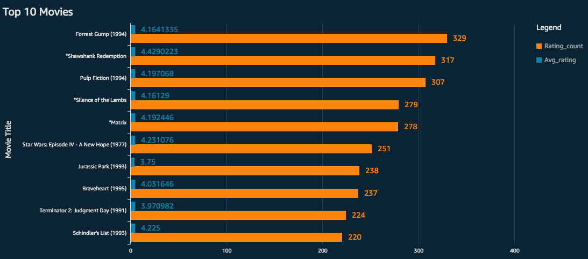
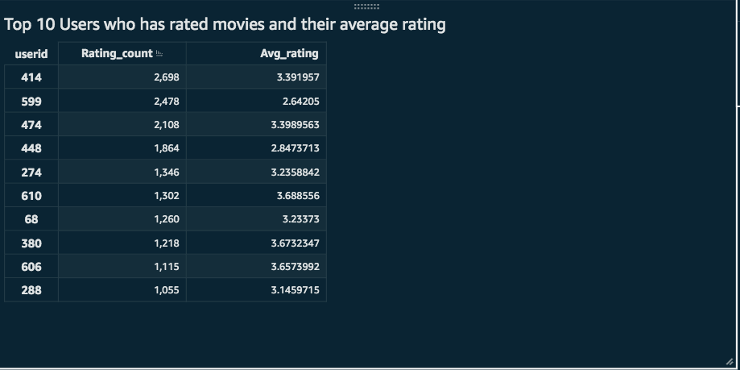
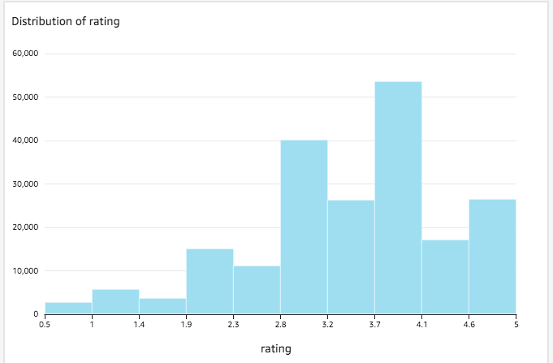
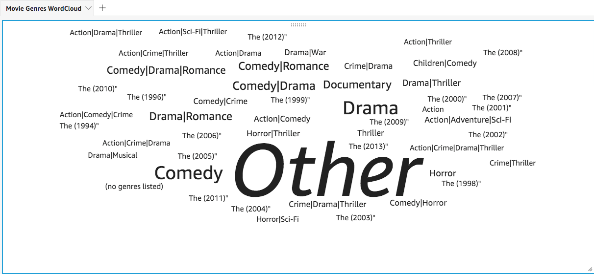

# Data Visualization

## Ad-hoc processing

Amazon Athena provides an easy way to query the data in S3 with SQL queries. Once I had the data prepared and delivered from Data Preparation step, had used Athena to create few ad-hoc queries to get an understanding on the data.

Ad-hoc queries are created by joining various tables with in the database, and then performed group by sql statements to get the intented visualizations. Following visualizations show the 4 ad-hoc queries generted by combining various tables.

### Top 10 Movies where users have rated and their average ratings

### Top 10 Users who have rated most movies and their average ratings

### Distribution of Ratings

### Word Cloud by Movie Genres

