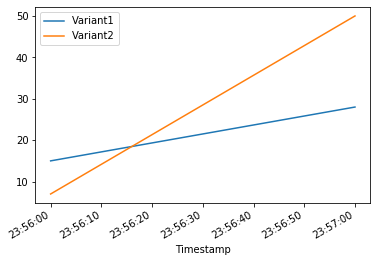

# Importing Libraries


```python
%%time
%matplotlib inline
from datetime import datetime, timedelta
import time,os,boto3,re,json
import numpy as np
from sagemaker import get_execution_role, session
from sagemaker.session import production_variant
region= boto3.Session().region_name
role = get_execution_role()
sm_session = session.Session(boto3.Session())
sm = boto3.Session().client("sagemaker")
sm_runtime = boto3.Session().client("sagemaker-runtime")
from scipy.sparse import lil_matrix
from scipy.sparse import csr_matrix
from sagemaker.deserializers import JSONDeserializer
from sagemaker.serializers import CSVSerializer
from sagemaker.predictor import json_deserializer
import scipy.sparse as sparse
```

    CPU times: user 1.36 s, sys: 99.9 ms, total: 1.46 s
    Wall time: 5.53 s


# Defining the models as variants


```python
model_name1='V3Blackbelt-2020-12-13-22-12-49-701'
model_name2='V3Blackbelt-2020-12-15-15-18-21-414'
```


```python
prodvariant1 = production_variant(model_name=model_name1,
                              instance_type="ml.m5.xlarge",
                              initial_instance_count=1,
                              variant_name='Variant1',
                              initial_weight=0.3)

prodvariant2 = production_variant(model_name=model_name1,
                              instance_type="ml.m5.xlarge",
                              initial_instance_count=1,
                              variant_name='Variant2',
                              initial_weight=0.3)

(prodvariant1,prodvariant2)
```


    ({'ModelName': 'V3Blackbelt-2020-12-13-22-12-49-701',
      'InstanceType': 'ml.m5.xlarge',
      'InitialInstanceCount': 1,
      'VariantName': 'Variant1',
      'InitialVariantWeight': 0.3},
     {'ModelName': 'V3Blackbelt-2020-12-13-22-12-49-701',
      'InstanceType': 'ml.m5.xlarge',
      'InitialInstanceCount': 1,
      'VariantName': 'Variant2',
      'InitialVariantWeight': 0.3})


# Deploying endpoint using 2 production variants


```python
endpoint_name='V5Blackbelt'
sm_session.endpoint_from_production_variants(
    name=endpoint_name,
    production_variants=[prodvariant1, prodvariant2])
```

    -------------!


    'V5Blackbelt'


# Creating inference data, outside of test data


```python
def fm_serializer(data):
    js = {"instances": []}
    for row in data:
        js["instances"].append({"features": row.tolist()})
    return json.dumps(js).encode()
```

# Invoking Endpoint with Production Variants


```python
predictions = ''
X1 = lil_matrix((100,9628)).astype('float32')
X1[0:9, :500] = np.ones(500)
c = 0
for i in X1:
  X1_arr = i.toarray()
  payload = fm_serializer(X1_arr)
  response = sm_runtime.invoke_endpoint(EndpointName=endpoint_name,
                                     ContentType="application/json",
                                     Body=payload)
```

# Collecting Cloudwatch Logs and plotting


```python
import pandas as pd
cw = boto3.Session().client("cloudwatch")
def get_invocation_metrics_for_endpoint_variant(endpoint_name,
                                                variant_name,
                                                start_time,
                                                end_time):
    metrics = cw.get_metric_statistics(
        Namespace="AWS/SageMaker",
        MetricName="Invocations",
        StartTime=start_time,
        EndTime=end_time,
        Period=60,
        Statistics=["Sum"],
        Dimensions=[
            {
                "Name": "EndpointName",
                "Value": endpoint_name
            },
            {
                "Name": "VariantName",
                "Value": variant_name
            }
        ]
    )
    return pd.DataFrame(metrics["Datapoints"])\
            .sort_values("Timestamp")\
            .set_index("Timestamp")\
            .drop("Unit", axis=1)\
            .rename(columns={"Sum": variant_name})

def plot_endpoint_metrics(start_time=None):
    start_time = start_time or datetime.now() - timedelta(minutes=60)
    end_time = datetime.now()
    metrics_variant1 = get_invocation_metrics_for_endpoint_variant(endpoint_name, prodvariant1["VariantName"], start_time, end_time)
    metrics_variant2 = get_invocation_metrics_for_endpoint_variant(endpoint_name, prodvariant2["VariantName"], start_time, end_time)
    metrics_variants = metrics_variant1.join(metrics_variant2, how="outer")
    metrics_variants.plot()
    return metrics_variants
```


```python
print("Waiting a minute for initial metric creation...")
time.sleep(60)
plot_endpoint_metrics()
```

    Waiting a minute for initial metric creation...


<div>
<style scoped>
    .dataframe tbody tr th:only-of-type {
        vertical-align: middle;
    }

    .dataframe tbody tr th {
        vertical-align: top;
    }

    .dataframe thead th {
        text-align: right;
    }
</style>
<table border="1" class="dataframe">
  <thead>
    <tr style="text-align: right;">
      <th></th>
      <th>Variant1</th>
      <th>Variant2</th>
    </tr>
    <tr>
      <th>Timestamp</th>
      <th></th>
      <th></th>
    </tr>
  </thead>
  <tbody>
    <tr>
      <th>2020-12-15 23:56:00+00:00</th>
      <td>15.0</td>
      <td>7.0</td>
    </tr>
    <tr>
      <th>2020-12-15 23:57:00+00:00</th>
      <td>28.0</td>
      <td>50.0</td>
    </tr>
  </tbody>
</table>
</div>





```python

```
