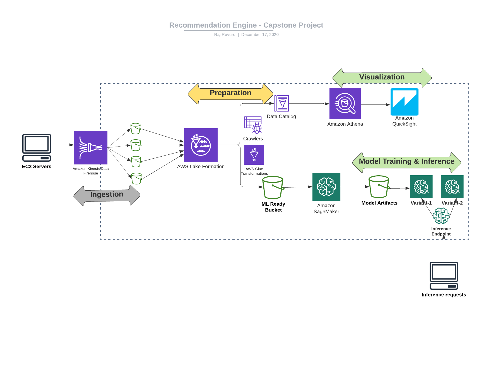

# About the AWS ML-Blackbelt Capstone project 
This capstone project is submitted part of AWS blackbelt NA program.

## Recommendation Enigne
Recommender systems (RecSys) are becoming more prevalent these days with the explosion of personalized recommendations based on users interactions with items. Items in this context can mean anything wherein  users interact with them. For example items can be movies, songs, videos, and shopping items on any e-commerce websites. Businesses these days solicit and collect information regarding users interactions on these items to build a users preference profile, and then proceed to recommend items for the user. Some of common use cases for recommender systems are 

* Movies Ratings & Recommendation
* Videos Ratings & recommendation
* Songs Ratings & recommendation
* Recommendation of items on any e-commerce website (Apparel, food, etc)
* Healthcare recommendation of doctors etc!

Recommendations can broadly classified as the following 
* Non personalized recommendations:  This is just a blanket recommendation mechanism, for example, what users in a certain zip code have watched or liked any movies or songs
* Content based recommendations: This is personalized recommendation for a user, based on the past interactions of similar type of items, for example, if user likes/prefers a crime genre.
* Collaborative filtering: This personalized recommendations is derived based on similarities with other users/items interactions. For example, if a user who like crime & action genres, is likely to prefer sci-fi. 

#### My Architecture
This project utilizes various Data & Machine learning services by AWS to craft an end-to-end machine learning lifecycle project. The following shows the architecture.

This project is ogranized into 6 modules,
- [Data Ingestion & Transformation](/DataIngestion/DataIngestion.md)  For this phase of the project, we are going to use AWS EC2, AWS Kinesis Firehose & AWS S3 services.
- [Data Preparation](/DataPreparation/DataPreparation.md) For this phase of the project, going to leverage AWS Lakeformation as a centralized datalake, as LakeFormation provides user and data governance. 
- [Data Visualization](/DataVisualization/DataVisualization.md) For this phase of the project, going to leverage AWS Athena, and AWS Quicksight for ad-hoc data analytics and visualization.
- [Training Models](/TrainingModels/) This folder consists of jupyter notebooks for the trained models
* Training Model - Factorization Machines with Regressor
* Training Model - kNN with Regressor
- [Evaluate ML Models](/Evaluation/) This folder consists of jupyter notebooks to evaluate hyperparameter tuning jobs
* Evaluate Hyperparameter tuning job - Factorization with Regressor
* Evaluate Hyperparameter tuning job - kNN with Regressor
- [Machine Learning Implementation](/MLops/) This folder consists of jupyter notebooks to deploy a new endpoint with 2 production variants with distributed weights to perform A/B testing
* MLOps - AB- Testing for FM-Regressor
* MLOps - AB - Testing for k-NN